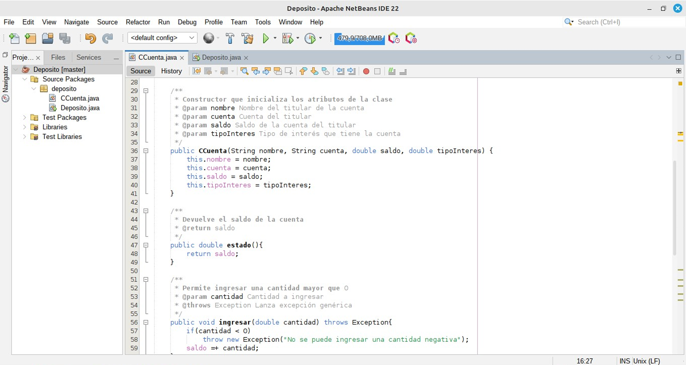
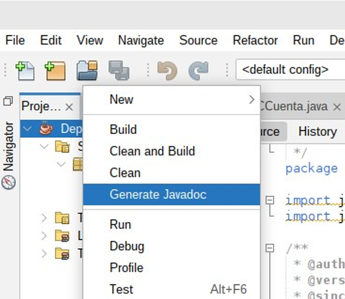
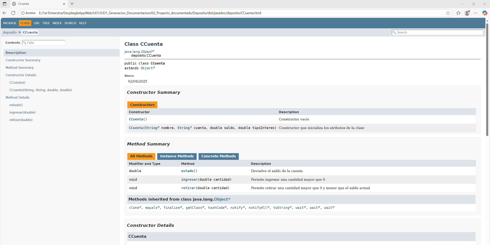

# UD1 – Generación de Documentación

En esta práctica he aprendido a usar herramientas que generan documentación de un proyecto de forma automática. 
En mi caso he trabajado con **Javadoc**, he hecho una pequeña comparativa de distintas herramientas, he documentado 
un proyecto en Java del curso anterior y he añadido una reflexión personal sobre la experiencia.

---

## Contenido de la práctica

- **01_Comparativa/** → Carpeta con la tabla comparativa de diferentes herramientas de documentación.  
- **02_Proyecto_documentado/** → Proyecto Java con el código comentado y la documentación generada automáticamente con **Javadoc**.  
- **03_Reflexion/** → Reflexión personal sobre el uso de la herramienta, sus ventajas, desventajas y si la recomendaría en proyectos colaborativos.

---

## Cómo visualizar la documentación

1. Descargar este repositorio o clonarlo en tu equipo.  
2. Abrir la carpeta `02_Proyecto_documentado/Deposito/dist/javadoc/`.  
3. Hacer doble clic en el archivo `index.html` para abrir la documentación generada en el navegador.

---

## Generación de la documentación

Para generar la documentación con **Javadoc**, he seguido estos pasos sencillos:

1. He añadido todos los comentarios necesarios en el código usando el formato `/** ... */` sobre las clases y métodos.

*Código comentado:*  

2. Hago clic derecho sobre el proyecto en **NetBeans** y selecciono la opción **"Generate Javadoc"**.

*Opción para generar la documentación:*  

3. Automáticamente se crea toda la documentación del proyecto dentro de la carpeta `dist/javadoc/`.  
   Solo hay que abrir el archivo `index.html` en el navegador para verla.

*Vista previa de la documentación generada:*  

---

**Autora:** Aroa Ramos  
Curso: 2º DAW – Despliegue de Aplicaciones Web
