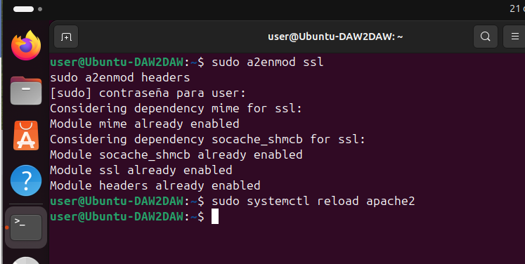
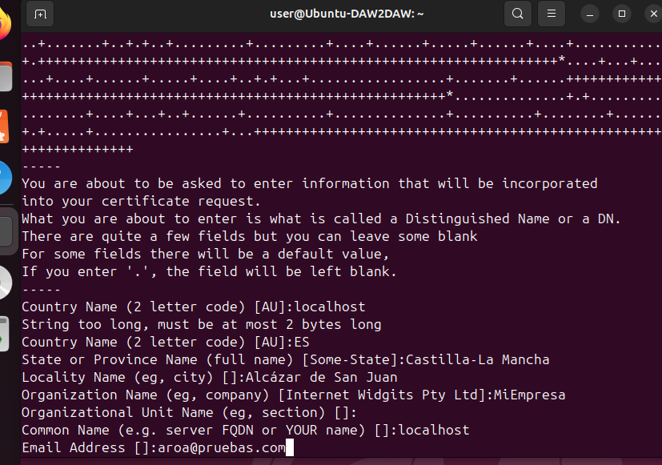
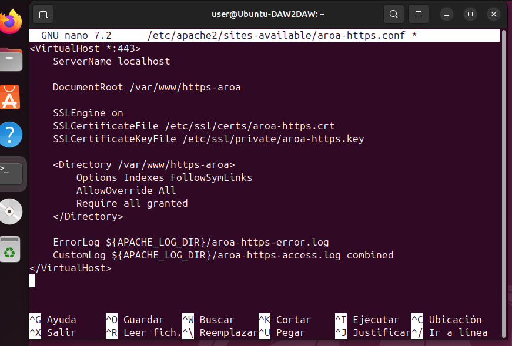
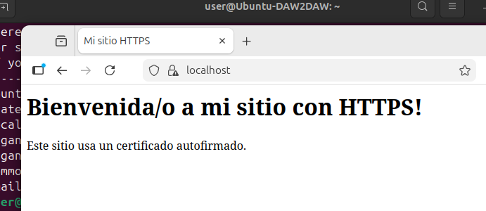

# Implementación de HTTPS en Apache2 sobre Ubuntu

En esta práctica he investigado y configurado el protocolo HTTPS en un servidor web Apache2 con Ubuntu. El objetivo era conseguir que mi sitio web funcionara de forma segura con certificados SSL/TLS.

---

## 1. Investigación

### 1.1 Funcionamiento del protocolo HTTPS

HTTPS es básicamente HTTP pero con una capa de seguridad añadida. Utiliza SSL/TLS para cifrar toda la información que viaja entre el navegador y el servidor. 

Gracias a este cifrado, si alguien intercepta la comunicación, no puede leer los datos porque están encriptados. Esto es muy importante sobre todo cuando introduces contraseñas, datos de tarjetas de crédito o cualquier información personal.

Otra cosa importante es que HTTPS también verifica que realmente te estás conectando al servidor correcto y no a uno falso, gracias a los certificados digitales.

### 1.2 Tipos de certificados SSL/TLS

He visto que hay dos tipos principales de certificados:

**Certificado autofirmado:**
- Lo generas tú mismo en tu propio servidor
- Es gratis y rápido de hacer
- El problema es que los navegadores no confían en él y te salen advertencias
- Vale perfectamente para hacer pruebas o para practicar como en mi caso

**Certificado de una CA (Autoridad Certificadora):**
- Lo emite una empresa especializada en esto, como Let's Encrypt, que es gratuita
- El navegador confía automáticamente en estos certificados
- Es lo que usan todas las páginas web reales
- No te sale ninguna advertencia al entrar

Para esta práctica he usado un certificado autofirmado porque es más sencillo para empezar.

### 1.3 Módulos necesarios en Apache2

Para que Apache2 pueda trabajar con HTTPS necesita tener activados dos módulos:

- **ssl**: Es el módulo principal que permite usar SSL/TLS
- **headers**: Sirve para gestionar las cabeceras HTTP, útil para redirecciones y seguridad extra

---

## 2. Implementación paso a paso

### 2.1 Instalación y verificación de Apache2

Lo primero que hice fue comprobar que tenía Apache2 instalado en mi Ubuntu. Como ya lo tenía instalado de antes, estaba funcionando correctamente.

### 2.2 Activar los módulos SSL y headers

Activé los dos módulos necesarios con estos comandos:

```bash
sudo a2enmod ssl
sudo a2enmod headers
sudo systemctl reload apache2
```



Cuando ejecuté los comandos me salió que algunos módulos ya estaban activados (como `ssl` que decía "Module ssl already enabled") y otros se activaron en ese momento. Al final me confirmó que el módulo `headers` se había activado correctamente. Después recargué Apache para que los cambios se aplicaran.

### 2.3 Generar el certificado SSL autofirmado

Usé OpenSSL para crear mi propio certificado:

```bash
sudo openssl req -x509 -nodes -days 365 -newkey rsa:2048 \
  -keyout /etc/ssl/private/aroa-https.key \
  -out /etc/ssl/certs/aroa-https.crt
```

Al ejecutarlo me pidió rellenar varios datos:

- **Country Name**: ES
- **State or Province**: Castilla-La Mancha
- **Locality Name**: Alcázar de San Juan 
- **Organization Name**: MiEmpresa
- **Organizational Unit Name**: Lo dejé en blanco
- **Common Name**: Puse **localhost** (esto es muy importante que coincida con el ServerName luego)
- **Email Address**: aroa@pruebas.com



El comando genera dos archivos importantes: el certificado (.crt) y la clave privada (.key). La clave privada es muy importante mantenerla segura porque si alguien la consigue podría hacerse pasar por tu servidor.

### 2.4 Configurar el VirtualHost para HTTPS

Primero creé una carpeta para mi sitio web:

```bash
sudo mkdir -p /var/www/https-aroa
```

Luego creé un archivo HTML simple dentro para tener algo que mostrar:

```bash
sudo nano /var/www/https-aroa/index.html
```

Puse un HTML básico:

```html
<!DOCTYPE html>
<html>
<head>
    <meta charset="UTF-8">
    <title>Mi sitio HTTPS</title>
</head>
<body>
    <h1>Bienvenida/o a mi sitio con HTTPS!</h1>
    <p>Este sitio usa un certificado autofirmado.</p>
</body>
</html>
```

Después tuve que crear el archivo de configuración del VirtualHost:

```bash
sudo nano /etc/apache2/sites-available/aroa-https.conf
```

Aquí está mi configuración completa:

```apache
<VirtualHost *:443>
    ServerName localhost

    DocumentRoot /var/www/https-aroa

    SSLEngine on
    SSLCertificateFile /etc/ssl/certs/aroa-https.crt
    SSLCertificateKeyFile /etc/ssl/private/aroa-https.key

    <Directory /var/www/https-aroa>
        Options Indexes FollowSymLinks
        AllowOverride All
        Require all granted
    </Directory>

    ErrorLog ${APACHE_LOG_DIR}/aroa-https-error.log
    CustomLog ${APACHE_LOG_DIR}/aroa-https-access.log combined
</VirtualHost>
```



Lo más importante de esta configuración es:
- El puerto **443** que es el que usa HTTPS por defecto
- **SSLEngine on** para activar SSL en este VirtualHost
- Las rutas correctas a mi certificado y mi clave privada
- El **DocumentRoot** apuntando a la carpeta donde está mi página web
- Los logs personalizados para poder ver los accesos y errores

### 2.5 Activar el sitio y reiniciar Apache

Una vez configurado todo, activé mi nuevo sitio:

```bash
sudo a2ensite aroa-https.conf
```

Antes de reiniciar comprobé que no había errores de sintaxis:

```bash
sudo apache2ctl configtest
```

Me salió "Syntax OK" así que todo estaba bien. Entonces reinicié Apache:

```bash
sudo systemctl restart apache2
```

También comprobé que Apache estaba escuchando en el puerto 443:

```bash
sudo netstat -tlnp | grep :443
```

Y efectivamente estaba ahí, esperando conexiones HTTPS.

### 2.6 Verificación del funcionamiento

Abrí Firefox y puse en la barra de direcciones: `https://localhost`



Mi página se cargó mostrando el mensaje que había puesto en el HTML.

## 3. Conclusiones

Esta práctica me ha resultado muy útil para entender cómo funciona realmente la seguridad en las páginas web. 

### Lo que he aprendido:

- Cómo HTTPS protege la información usando cifrado SSL/TLS
- La diferencia entre certificados autofirmados y los de verdad que emiten las autoridades certificadoras
- Cómo configurar Apache2 para que funcione con SSL/TLS
- A generar certificados con OpenSSL y rellenar correctamente los datos
- La importancia del puerto 443 para HTTPS y del puerto 80 para HTTP
- Cómo hacer redirecciones automáticas de HTTP a HTTPS

### Dificultades que tuve:

Al principio pensaba que había hecho algo mal cuando el navegador me decía que la conexión no era privada y que había un riesgo de seguridad. Pero luego entendí que es normal cuando usas un certificado autofirmado. El navegador no puede verificar quién ha firmado el certificado porque lo hemos firmado nosotros mismos.

También tuve un pequeño lío al principio con las rutas en el archivo de configuración del VirtualHost. Me costó un poco entender dónde iba cada cosa, pero una vez lo vi claro ya fue más fácil.
