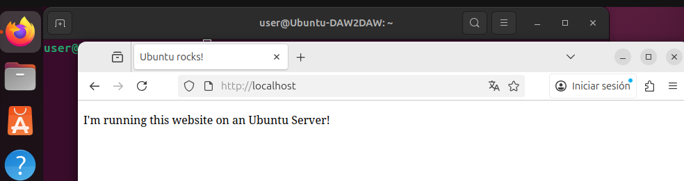
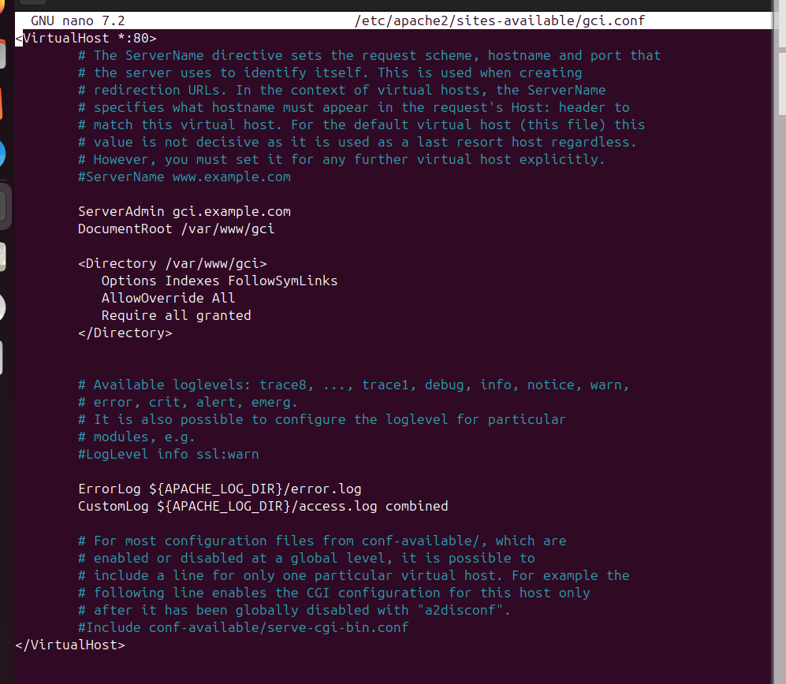
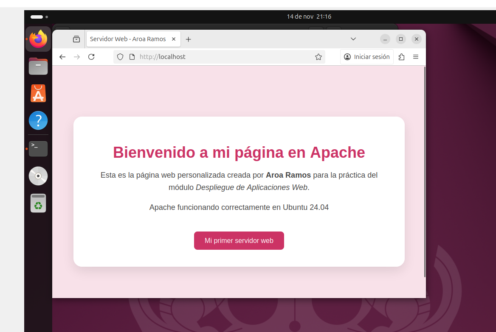
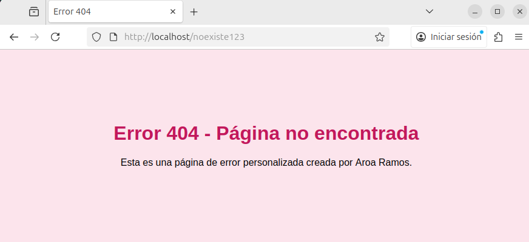

# Memoria: Instalación y Configuración de Apache en Ubuntu 24.04

## Resumen

En este documento explico todo el proceso que he realizado para instalar y configurar el servidor web Apache dentro de una máquina virtual Ubuntu 24.04. He seguido el tutorial oficial de Ubuntu para instalar Apache, he creado una página web personalizada y también he puesto en práctica un tutorial adicional que consiste en crear una página de error 404 personalizada. A lo largo del trabajo incluyo las pruebas realizadas, los problemas encontrados y una valoración personal..

## Palabras clave

Apache, Ubuntu, servidor web, VirtualHost, DocumentRoot, error 404, configuración web, despliegue

---

## Índice

1. Introducción  
    1.1 Contexto  
    1.2 ¿Qué es Apache?  
    1.3 Alternativas posibles  
    1.4 Motivación del proyecto  

2. Actividades realizadas  
    2.1 Instalación de Apache  
    2.2 Identificación del DocumentRoot y creación del sitio web  
    2.3 Configuración del VirtualHost para mi sitio web  
    2.4 Activación de AllowOverride para el tutorial adicional 
    2.5 Tutorial adicional (error 404 personalizado)
    2.6 Pruebas realizadas  
    2.7 Problema encontrado durante la configuración  

3. Resultados  
4. Valoración personal  
5. Conclusión  
6. Bibliografía  
7. Anexos 

---

## 1. Introducción

### 1.1 Contexto

Este documento forma parte del módulo **Despliegue de Aplicaciones Web** dentro del segundo curso del ciclo formativo DAW. Se ha realizado en una máquina virtual en **VirtualBox**, utilizando **Ubuntu 24.04** como sistema operativo de servidor.

### 1.2 ¿Qué es Apache?

Apache es un servidor web muy utilizado en todo el mundo. Permite mostrar páginas web a través del navegador y forma parte del stack LAMP (Linux, Apache, MySQL y PHP). Es gratuito, estable y extensible, lo que lo convierte en una de las opciones más usadas tanto en entornos educativos como profesionales.

### 1.3 Alternativas posibles

Otras alternativas a Apache que también se utilizan bastante:

- **Nginx**: muy rápido y ligero.  
- **LiteSpeed**: orientado a hosting comercial.  
- **Caddy**: moderno y con HTTPS automático.  

### 1.4 Motivación del proyecto

La motivación principal es aprender a desplegar contenido web en un servidor real, entendiendo cómo funcionan los servicios, los VirtualHost, los permisos y la estructura interna de Apache. Esto servirá como base para despliegues más avanzados.

---

## 2. Actividades realizadas

### 2.1 Instalación de Apache

Siguiendo el [tutorial oficial](https://ubuntu.com/tutorials/install-and-configure-apache#1-overview)

Ejecuté:

```
sudo apt update
sudo apt install apache2
```

Y comprobé el estado:
```
sudo systemctl status apache2
```
El servicio se encontraba en active (running).

### 2.2 Identificación del DocumentRoot y creación del sitio web

Siguiendo el tutorial de Ubuntu, descubrí que Apache trae activado por defecto un sitio básico cuya carpeta es:

`/var/www/html`

Este es el sitio que muestra la “Apache Default Page”.  
Como yo quería crear mi propia página personalizada, el tutorial indicaba que lo recomendable era **crear una carpeta nueva para un sitio nuevo**, y no tocar la carpeta por defecto.

Así que ejecuté:

```
sudo mkdir /var/www/gci
```
Con esto creé el directorio donde iba a estar mi página web.

Luego entré en él y creé mi propio archivo index.html:
```
cd /var/www/gci
sudo nano index.html
```
Ahí pegué mi primer HTML (más tarde lo personalicé con colores y estilo propio)

Con esto entendí la diferencia entre tener archivos creados y que Apache realmente los use.

### 2.3 Configuración del VirtualHost para mi sitio web

El tutorial explicaba que, para que Apache cargara mi sitio nuevo, hay que crear un VirtualHost propio.  
Así que creé el archivo:

```
sudo nano /etc/apache2/sites-available/gci.conf
```

Y añadí la configuración recomendada:

```
<VirtualHost *:80>
    ServerAdmin webmaster@localhost
    ServerName gci.example.com
    DocumentRoot /var/www/gci

    <Directory /var/www/gci>
        Options Indexes FollowSymLinks
        AllowOverride All
        Require all granted
    </Directory>

    ErrorLog ${APACHE_LOG_DIR}/gci_error.log
    CustomLog ${APACHE_LOG_DIR}/gci_access.log combined
</VirtualHost>
```

Luego activé el sitio con:

```
sudo a2ensite gci.conf
sudo systemctl reload apache2
```

### 2.4 Activación de AllowOverride

El tutorial adicional que encontré (para personalizar errores 404) pedía que el directorio tuviera activado: *AllowOverride All*. Lo añadí en el bloque `<Directory>` del VirtualHost.

Gracias a esto Apache permite usar `.htaccess`, cosa que fue necesaria para aplicar el `ErrorDocument 404`.

### 2.5 Tutorial adicional (error 404 personalizado)

Busqué un [tutorial sobre cómo personalizar errores en Apache](https://httpd.apache.org/docs/2.4/custom-error.html) y seguí los siguientes pasos:

1.  Creé el archivo **.htaccess** en el directorio `/var/www/gci` y añadí la directiva para redirigir el error 404:
    ```
    ErrorDocument 404 /404.html
    ```

2.  Creé la página de error **404.html** dentro del directorio de mi sitio (`/var/www/gci`).

3.  Probé el resultado escribiendo en el navegador una URL que no existía. Apareció mi error 404 personalizado.

### 2.6 Pruebas realizadas

Realicé varias pruebas para comprobar que todo funcionaba correctamente:

* **Página principal:** Al acceder a `http://localhost`, muestra mi página personalizada (lo que confirma que el **VirtualHost** está activo).
* **Ruta inexistente:** Muestra correctamente el **error 404 personalizado** (lo que confirma que la directiva `.htaccess` funciona).
* **Comprobación externa:** Una compañera comprobó desde la misma máquina virtual que el sitio también funcionaba correctamente.

### 2.7 Problema encontrado durante la configuración

Al principio tuve un problema importante: cuando intentaba abrir mi página personalizada, seguía apareciendo la página por defecto de Apache (“Apache2 Default Page” o “Ubuntu is running this website”).

Durante un tiempo pensé que mi archivo `index.html` estaba mal, pero finalmente descubrí que el error se debía a que estaba editando el archivo en una **carpeta equivocada**:

```
/var/www/html/index.html
```

El problema estaba en que Apache **no estaba usando esa carpeta**, sino el sitio virtual definido en:

```
/etc/apache2/sites-enabled/gci.example.conf
```

que mostraba el `DocumentRoot` correcto como:
```
DocumentRoot /var/www/gci
```

Cuando coloqué mi página dentro de `/var/www/gci` y reinicié Apache, se mostró correctamente. Este problema me ayudó a entender cómo funcionan realmente los VirtualHost y cómo Apache decide qué sitio web cargar.

---

## 3. Resultados

Los resultados obtenidos han sido los esperados y confirman el éxito de la configuración:

* **Apache** quedó instalado y ejecutándose correctamente en el sistema.
* El **VirtualHost** configurado apuntando a `/var/www/gci` se confirmó su correcto funcionamiento y prioridad.
* La **página personalizada** se sirvió sin incidencias al acceder a `http://localhost`.
* El sistema aceptó y aplicó las directivas del archivo **.htaccess**.
* El **error 404 personalizado** funcionó según lo previsto, demostrando la personalización del manejo de errores.

---

## 4. Valoración personal

Durante esta práctica me he dado cuenta de que instalar Apache no es solo ejecutar un par de comandos, sino entender cómo está organizada su configuración. Uno de los puntos que más me llamó la atención fue descubrir que el servidor no estaba usando el `DocumentRoot` típico, y eso me obligó a revisar los VirtualHost y a entender mejor cómo decide Apache qué sitio cargar.

Crear mi propia página y verla funcionar en el navegador me ayudó a comprender de forma más práctica qué significa **desplegar contenido. También me resultó interesante personalizar el error 404, porque pude probar el uso de .htaccess y ver cómo pequeños cambios afectan directamente al servidor.

Esta práctica me ha servido para entender mejor el papel que tiene cada ajuste dentro del servidor.

---

## 5. Conclusión

Con esta práctica, he podido aprender cómo funciona Apache y qué pasos son necesarios para configurarlo correctamente.

Los principales aprendizajes han sido los siguientes:

* **Instalación y despliegue:** Instalación exitosa del servidor y despliegue de mi propia página web.
* **Organización de archivos:** Comprensión de la estructura de archivos de Apache y la configuración de `DocumentRoot`.
* **Configuración avanzada:** Práctica con la configuración de VirtualHosts para gestionar múltiples sitios.
* **Manejo de directivas:** Uso de .htaccess y personalización del error 404.
* **Confianza ganada:** Más seguridad para continuar trabajando con servidores web.

---

## 6. Bibliografía

* **Tutorial oficial de Ubuntu sobre Apache:**
  https://ubuntu.com/tutorials/install-and-configure-apache#1-overview

* **Tutorial de instalación seguido en clase:**
  https://foro.puntocomunica.com/viewtopic.php?t=312

* **Documentación oficial de Apache sobre errores (Práctica adicional):**
  https://httpd.apache.org/docs/2.4/custom-error.html

---

## 7. Anexos

A continuación, se adjuntan las capturas de pantalla que documentan el proceso y los resultados de la configuración:

* **Captura:** Apache funcionando
    
    
* **Captura:** Contenido del archivo VirtualHost gci.conf
    
    
* **Captura:** Página web personalizada
    
    
* **Captura:** Error 404 personalizado
    

