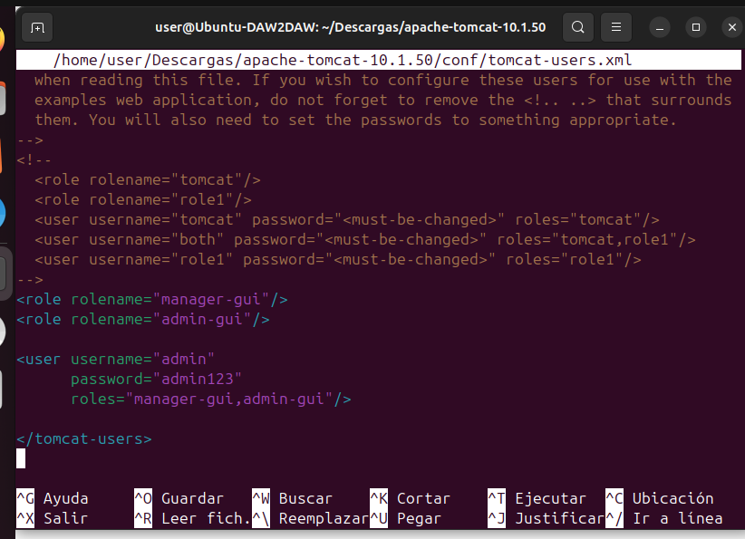
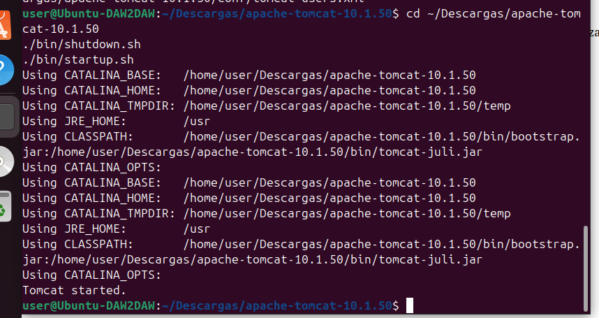
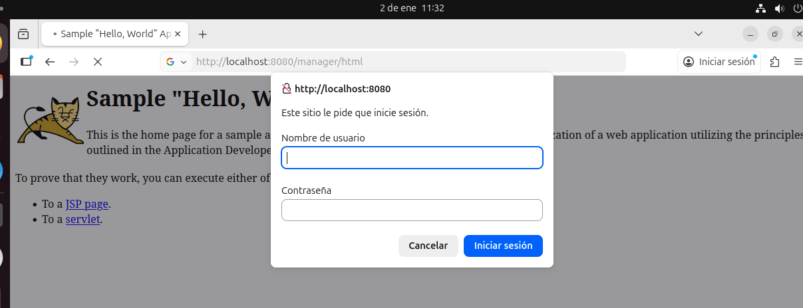
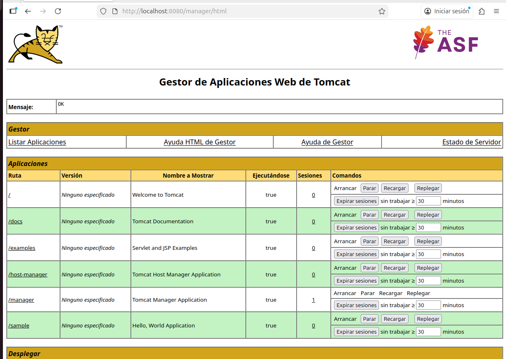
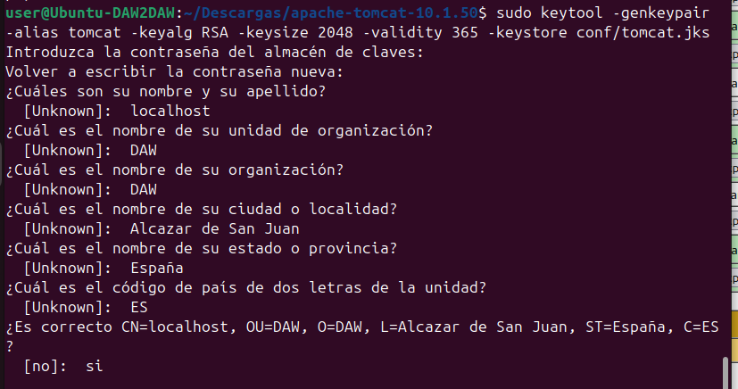
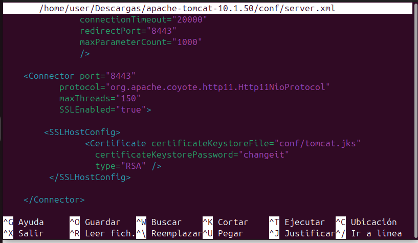
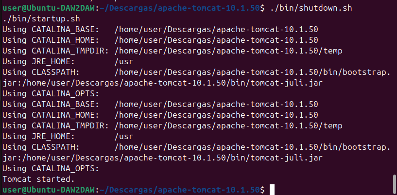
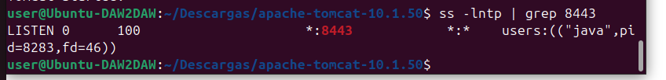
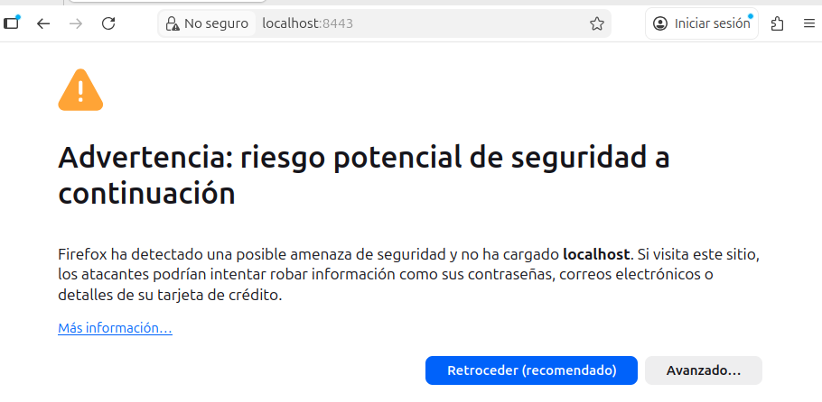
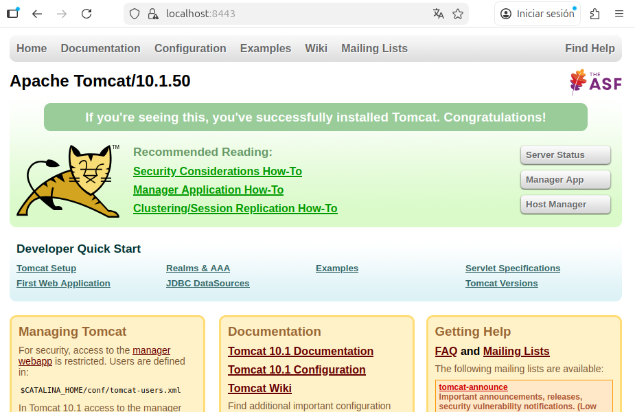

# Tomcat: Configuración de seguridad en Apache Tomcat

En este ejercicio realizo la configuración básica de seguridad en Apache Tomcat. Para ello creo usuarios y roles, restrinjo el acceso al Manager y configuro el acceso seguro mediante HTTPS utilizando un certificado autofirmado.

---

## 1. Configuración de usuarios y roles en Tomcat

Para permitir el acceso autenticado al gestor de aplicaciones de Tomcat, edito el archivo `tomcat-users.xml`, que se encuentra en la carpeta de configuración del servidor.

Ruta del archivo:  
`/home/user/Descargas/apache-tomcat-10.1.50/conf/tomcat-users.xml`

En este archivo defino los roles necesarios (`manager-gui` y `admin-gui`) y creo un usuario administrador con permisos para acceder al Manager de Tomcat.

Captura: definición de usuarios y roles en tomcat-users.xml  

---

## 2. Reinicio de Tomcat tras la configuración de usuarios

Después de modificar el archivo de usuarios, reinicio el servidor Tomcat para que los cambios se apliquen correctamente.

Captura: reinicio de Tomcat tras modificar tomcat-users.xml  

---

## 3. Acceso autenticado al Manager de Tomcat

Accedo al gestor de aplicaciones mediante la URL `/manager/html`. En este momento, Tomcat me solicita usuario y contraseña, lo que confirma que el acceso está protegido mediante autenticación.

Captura: solicitud de credenciales para acceder al Manager  

---

## 4. Acceso correcto al Gestor de Aplicaciones

Tras introducir las credenciales configuradas, accedo correctamente al Gestor de Aplicaciones Web de Tomcat, donde puedo ver y administrar las aplicaciones desplegadas.

Captura: acceso correcto al Manager de Tomcat  

---

## 5. Creación del keystore para HTTPS

Para habilitar el acceso seguro mediante HTTPS, genero un keystore utilizando la herramienta `keytool`. Este keystore contiene un certificado autofirmado que utilizará Tomcat para las conexiones seguras.

Captura: creación correcta del keystore  

---

## 6. Configuración del conector HTTPS en Tomcat

Edito el archivo `server.xml` y añado un conector HTTPS en el puerto 8443. En este conector indico el uso del keystore creado anteriormente para habilitar las conexiones SSL.

Captura: configuración del conector HTTPS en server.xml  

---

## 7. Reinicio de Tomcat tras la configuración HTTPS

Una vez realizada la configuración del conector HTTPS, reinicio de nuevo Tomcat para aplicar los cambios.

Captura: reinicio de Tomcat tras activar HTTPS  

---

## 8. Comprobación del puerto 8443

Compruebo que Tomcat está escuchando correctamente en el puerto 8443, lo que confirma que el conector HTTPS está funcionando.

Captura: Tomcat escuchando en el puerto 8443  

---

## 9. Acceso seguro a Tomcat mediante HTTPS

Accedo desde el navegador a `https://localhost:8443`. El navegador muestra una advertencia de seguridad debido a que el certificado es autofirmado, algo normal en entornos de pruebas. Tras aceptar la advertencia, accedo correctamente a la página de inicio de Tomcat mediante HTTPS.

Captura: advertencia de certificado autofirmado  

Captura: acceso correcto a Tomcat por HTTPS  

