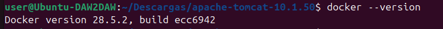
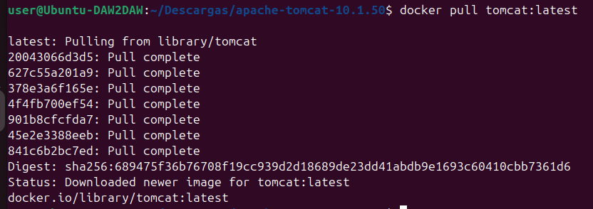
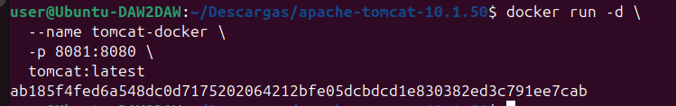
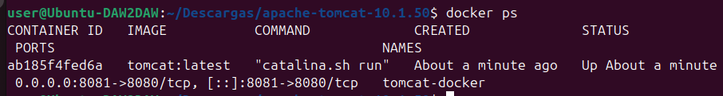
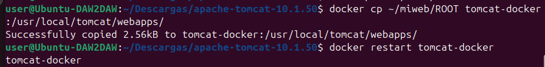
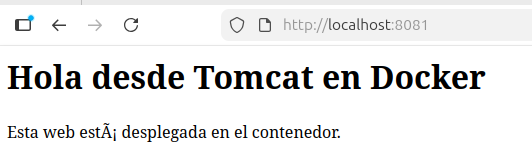

# Tomcat en contenedores (Docker)

En esta práctica trabajo con **Apache Tomcat en contenedores Docker**. Descargo la imagen oficial de Tomcat, ejecuto un contenedor, despliego una aplicación web dentro de él y comparo el funcionamiento con un Tomcat instalado de forma nativa.

---

## 1. Comprobación de Docker en el sistema

Antes de comenzar, compruebo que Docker está instalado y funcionando correctamente en el sistema.

Ejecuto el siguiente comando:

```bash
docker --version
````

**Captura: Docker instalado y operativo**


---

## 2. Descarga de la imagen oficial de Tomcat

Descargo la imagen oficial de Apache Tomcat desde Docker Hub utilizando el repositorio oficial.

```bash
docker pull tomcat:latest
```

La descarga se realiza correctamente y la imagen queda disponible en el sistema.

**Captura: descarga de la imagen oficial de Tomcat**


---

## 3. Creación y arranque del contenedor Tomcat

A continuación, creo y ejecuto un contenedor Tomcat a partir de la imagen descargada. Mapeo el puerto 8080 del contenedor al puerto 8081 de mi equipo para evitar conflictos.

```bash
docker run -d \
  --name tomcat-docker \
  -p 8081:8080 \
  tomcat:latest
```

**Captura: contenedor Tomcat arrancado**


---

## 4. Comprobación del contenedor en ejecución

Compruebo que el contenedor está en ejecución y escuchando correctamente en el puerto configurado.

```bash
docker ps
```

En la salida puedo ver el contenedor `tomcat-docker` en estado *Up* y el mapeo de puertos correcto.

**Captura: contenedor Tomcat en ejecución**


---

## 5. Despliegue de una aplicación web en el contenedor

Para desplegar una aplicación web, copio una carpeta llamada `ROOT` (con un `index.html`) al directorio de aplicaciones de Tomcat dentro del contenedor.

```bash
docker cp ~/miweb/ROOT tomcat-docker:/usr/local/tomcat/webapps/
```

Después reinicio el contenedor para aplicar los cambios:

```bash
docker restart tomcat-docker
```

**Captura: copia de la aplicación y reinicio del contenedor**


---

## 6. Comprobación del funcionamiento de la aplicación

Accedo desde el navegador a la aplicación desplegada en el contenedor usando la siguiente URL:

```
http://localhost:8081
```

La aplicación se muestra correctamente, confirmando que Tomcat funciona dentro del contenedor y que el despliegue se ha realizado con éxito.

**Captura: aplicación funcionando en Tomcat Docker**


---

## 7. Diferencias entre Tomcat nativo y Tomcat en Docker

A continuación comparo las principales diferencias entre un Tomcat instalado de forma tradicional y un Tomcat ejecutado en un contenedor Docker.

| Aspecto      | Tomcat nativo               | Tomcat en Docker            |
| ------------ | --------------------------- | --------------------------- |
| Instalación  | Manual en el sistema        | Mediante imagen Docker      |
| Dependencias | Java y configuración local  | Incluidas en la imagen      |
| Aislamiento  | Comparte sistema            | Aislado en contenedor       |
| Despliegue   | Copia directa en el sistema | Copia dentro del contenedor |
| Portabilidad | Menor                       | Muy alta                    |
| Eliminación  | Manual                      | Eliminando el contenedor    |

Tomcat en Docker facilita mucho el despliegue, la portabilidad y la limpieza del entorno, mientras que Tomcat nativo permite un control más directo del sistema.
