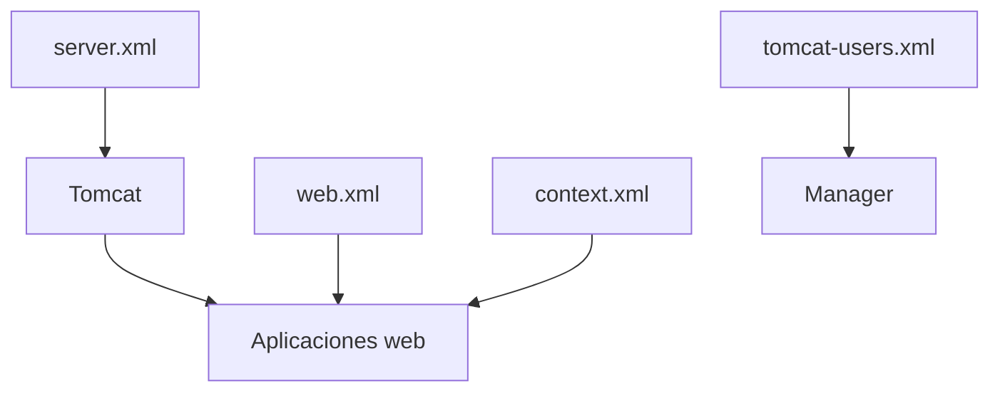

# Configuración de Apache Tomcat – Archivos principales

## Localización de los archivos de configuración

Para realizar esta práctica, he instalado Apache Tomcat de forma manual en mi máquina virtual con Ubuntu.  
Una vez descomprimido Tomcat, accedo a su estructura de carpetas desde la terminal hasta llegar a la carpeta `conf`, que es donde se encuentran los principales archivos de configuración del servidor.

La ruta seguida ha sido: `/Descargas/apache-tomcat-10.1.50/conf`.

En esta carpeta se pueden ver los archivos de configuración más importantes que utiliza Tomcat para su funcionamiento.

### Captura 1 – Archivos de configuración en la carpeta `conf`

---

## Descripción de los archivos principales de Tomcat

### `server.xml`

El archivo `server.xml` es uno de los archivos más importantes y delicados de Tomcat. Se encarga de definir la configuración interna del servidor, especialmente todo lo relacionado con los puertos y los conectores que permiten a Tomcat recibir peticiones.

En este archivo se configura:
- Los puertos en los que Tomcat escucha (por ejemplo 8080 para HTTP).
- Los conectores HTTP y HTTPS.
- La redirección entre HTTP y HTTPS.
- La forma en la que el servidor gestiona las conexiones.

Uno de los elementos más importantes de este archivo es la etiqueta `<Connector>`, que define el puerto y el protocolo utilizado. Por ejemplo, se puede ver un conector que escucha en el puerto 8080 y redirige al puerto 8443 cuando se usa HTTPS.

Es importante tener en cuenta que cualquier cambio en `server.xml` requiere reiniciar Tomcat para que tenga efecto.

### Captura 2 – Archivo `server.xml` abierto

---

### `web.xml`

El archivo `web.xml` es el archivo de configuración global de las aplicaciones web en Tomcat. Define una serie de valores por defecto que se aplican a todas las aplicaciones que se despliegan en el servidor, salvo que una aplicación tenga su propio `web.xml`.

En este archivo se pueden configurar:
- Las páginas de bienvenida (por ejemplo `index.html`).
- Servlets y filtros globales.
- Páginas de error personalizadas.
- Comportamientos generales de las aplicaciones web.

Este archivo no define aplicaciones concretas, sino reglas comunes que Tomcat aplica a todas ellas.

---

### `tomcat-users.xml`

El archivo `tomcat-users.xml` se utiliza para gestionar los usuarios y roles del propio Tomcat. No está relacionado con los usuarios de las aplicaciones web, sino con el acceso a las herramientas de administración del servidor.

En este archivo se pueden definir:
- Usuarios y contraseñas.
- Roles como `manager-gui` o `admin-gui`.
- Permisos para acceder al panel de administración de Tomcat.

Este archivo se utiliza, por ejemplo, para poder acceder a la aplicación Manager y administrar las aplicaciones desplegadas en el servidor.

---

### `context.xml`

El archivo `context.xml` se utiliza para definir recursos que pueden ser compartidos por las aplicaciones web. Normalmente se emplea para configurar conexiones a bases de datos y otros recursos reutilizables.

En este archivo se suelen definir:
- Recursos JNDI.
- Pools de conexiones a bases de datos.
- Configuración específica del contexto de las aplicaciones.

Este archivo permite centralizar la configuración de recursos sin tener que repetirla en cada aplicación.

---

## Mapa Visual

Esquema sencillo que representa la relación entre los principales archivos de configuración de Tomcat.

server.xml
   ↓
Define puertos y conectores
   ↓
Aplicaciones web

web.xml  → configuración global
context.xml → recursos compartidos
tomcat-users.xml → usuarios del manager

---

---

**Idea general del mapa:**  
El archivo `server.xml` define los puertos y la forma en la que Tomcat recibe las peticiones.  
Los archivos `web.xml` y `context.xml` se utilizan para configurar el comportamiento general y los recursos que usan las aplicaciones web.  
Por último, `tomcat-users.xml` sirve para gestionar los usuarios que pueden acceder a las herramientas de administración de Tomcat.
