# Tomcat: Integración Tomcat + Servidor web

En este ejercicio realizo la integración de Apache Tomcat con el servidor web Apache, utilizando un **reverse proxy**, de forma que la aplicación web desplegada en Tomcat sea accesible a través del servidor Apache.

---

## 1. Comprobación de Apache instalado y en ejecución

En primer lugar compruebo si Apache está instalado en la máquina virtual y qué versión tengo instalada.

**Captura: comprobación de la versión de Apache**
  
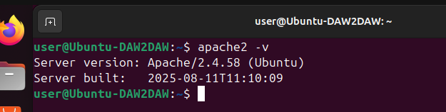

Después verifico que el servicio Apache está activo y funcionando correctamente.

**Captura: estado del servicio Apache activo**
  
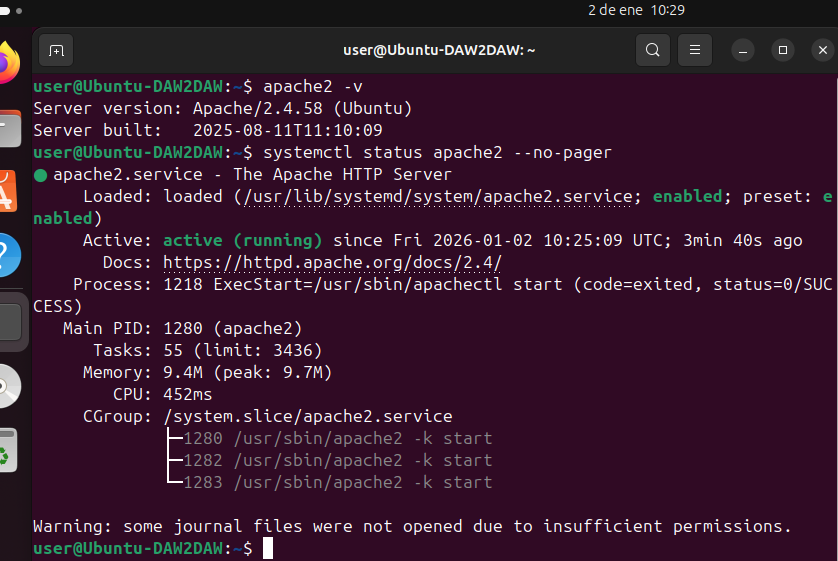

---

## 2. Activación de los módulos proxy necesarios

Para poder comunicar Apache con Tomcat, activo los módulos necesarios para usar Apache como reverse proxy.

Activo el módulo `proxy` y el módulo `proxy_http`.

**Captura: módulos proxy activados**
  
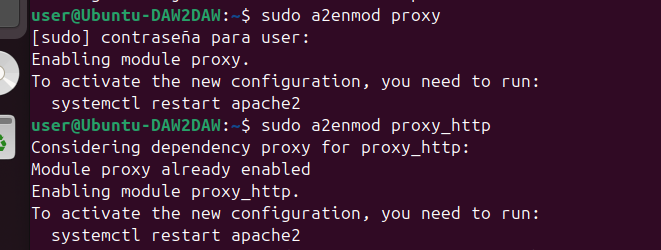

Tras activar los módulos, reinicio Apache para que los cambios tengan efecto.

**Captura: Apache reiniciado correctamente**
  

---

## 3. Configuración del VirtualHost para Tomcat

Creo un nuevo archivo de configuración para Apache donde defino el virtual host que actuará como proxy hacia Tomcat.

En este archivo configuro Apache para redirigir las peticiones al puerto 8080, donde se ejecuta Tomcat.

**Captura: activación del VirtualHost de Tomcat**
  
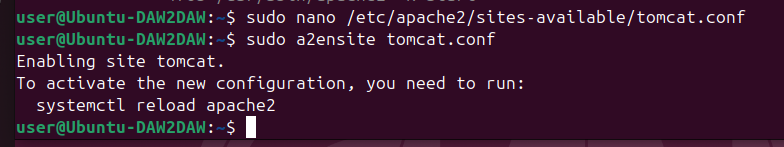

---

## 4. Desactivación del sitio por defecto de Apache

Para evitar conflictos con la configuración por defecto de Apache, desactivo el sitio `000-default.conf`.

**Captura: desactivación del sitio por defecto**
  
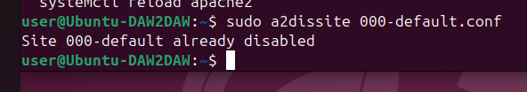

Después recargo Apache para aplicar los cambios.

**Captura: Apache recargado tras desactivar el sitio por defecto**
  
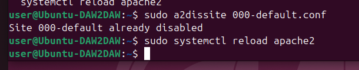

---

## 5. Primera prueba de acceso a la aplicación

Intento acceder a la aplicación `sample` a través de Apache usando el navegador, pero en este punto aparece un error 503.

**Captura: error 503 al acceder mediante Apache**
  
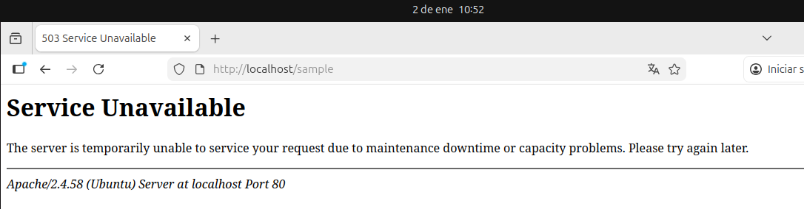

Compruebo el estado del puerto 8080 y veo que Tomcat no está escuchando en ese momento.

**Captura: Tomcat no escuchando en el puerto 8080**
  
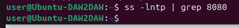

---

## 6. Arranque de Tomcat

Arranco de nuevo Tomcat desde su carpeta de instalación para asegurar que el servidor de aplicaciones está activo.

**Captura: arranque correcto de Tomcat**
  
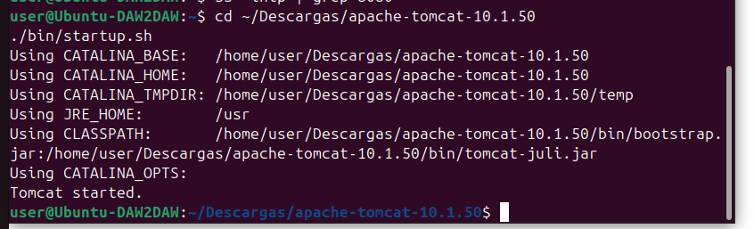

Compruebo que Tomcat vuelve a escuchar correctamente en el puerto 8080.

**Captura: Tomcat escuchando en el puerto 8080**
  
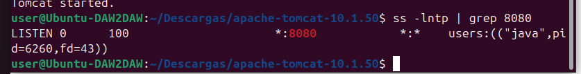

---

## 7. Acceso final a la aplicación a través de Apache

Una vez Tomcat está en funcionamiento, accedo de nuevo a la aplicación `sample` a través de Apache y compruebo que responde correctamente.

**Captura: aplicación desplegada funcionando a través de Apache**
  
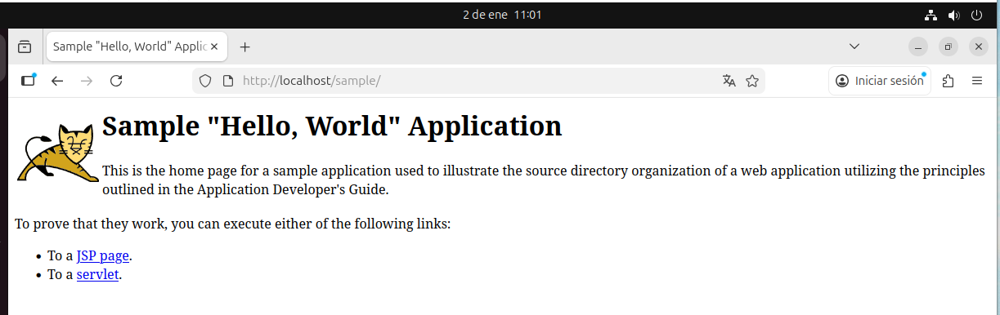
