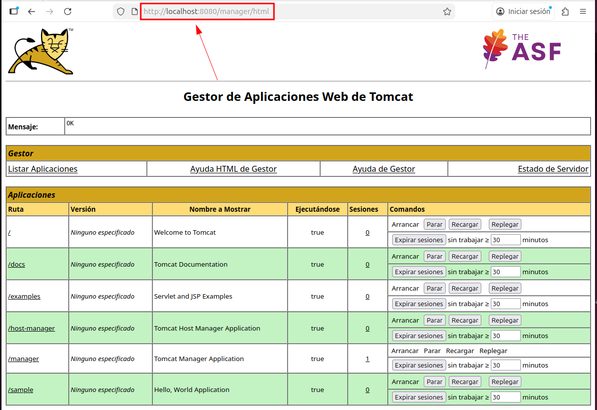
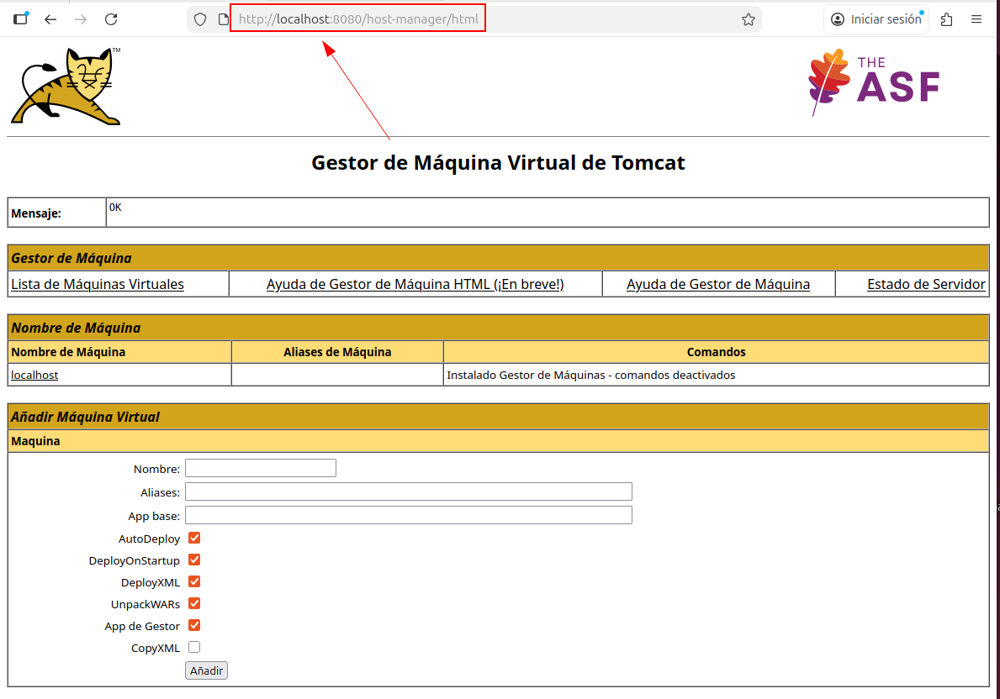

# Tomcat: Herramientas de administración — Manager y Host Manager

En este ejercicio trabajo con las herramientas de administración que proporciona Apache Tomcat a través del navegador: **Manager** y **Host Manager**. Accedo a ambas interfaces, investigo sus funciones principales y elaboro una ficha descriptiva de cada una.

---

## 1. Acceso a las interfaces de administración

Accedo a las herramientas de administración desde el navegador utilizando las siguientes rutas:

- **Manager**:  
  `http://localhost:8080/manager/html`

**Captura: acceso al Manager de Tomcat**  

- **Host Manager**:  
  `http://localhost:8080/host-manager/html`

**Captura: acceso al Host Manager de Tomcat**  

En ambos casos, Tomcat solicita autenticación mediante usuario y contraseña, lo que confirma que el acceso está protegido y solo es posible para usuarios autorizados.

---

## 2. Herramienta Manager de Tomcat

### ¿Qué es el Manager?

El **Manager** es la herramienta de administración que permite gestionar las aplicaciones web desplegadas en Tomcat. Desde esta interfaz puedo controlar el estado de las aplicaciones sin necesidad de usar la terminal.

### Funciones principales del Manager

Desde el Manager puedo:

- Ver todas las aplicaciones desplegadas en el servidor.
- Arrancar una aplicación web.
- Parar una aplicación web.
- Recargar una aplicación sin reiniciar Tomcat.
- Desplegar aplicaciones nuevas mediante archivos WAR.
- Eliminar aplicaciones desplegadas.
- Ver el número de sesiones activas de cada aplicación.

---

### Ficha descriptiva — Manager

- **Nombre de la herramienta:** Tomcat Manager  
- **Ruta de acceso:** `/manager/html`  
- **Tipo de gestión:** Aplicaciones web  
- **Funciones principales:**
  - Despliegue de aplicaciones WAR
  - Arranque y parada de aplicaciones
  - Recarga de aplicaciones
  - Gestión de sesiones
- **Requiere autenticación:** Sí  
- **Uso principal:** Administración y mantenimiento de aplicaciones web

---

## 3. Herramienta Host Manager de Tomcat

### ¿Qué es el Host Manager?

El **Host Manager** es la herramienta que permite gestionar los **hosts virtuales** de Tomcat. Un host virtual permite alojar varias aplicaciones o dominios diferentes en un mismo servidor Tomcat.

### Funciones principales del Host Manager

Desde el Host Manager puedo:

- Crear nuevos hosts virtuales.
- Eliminar hosts existentes.
- Configurar el nombre del host (dominio).
- Asignar una carpeta base a cada host.
- Gestionar múltiples aplicaciones bajo diferentes hosts.

---

### Ficha descriptiva — Host Manager

- **Nombre de la herramienta:** Tomcat Host Manager  
- **Ruta de acceso:** `/host-manager/html`  
- **Tipo de gestión:** Hosts virtuales  
- **Funciones principales:**
  - Creación de hosts virtuales
  - Eliminación de hosts
  - Configuración de dominios
  - Organización de aplicaciones por host
- **Requiere autenticación:** Sí  
- **Uso principal:** Gestión de entornos y dominios en Tomcat

---

## 4. Diferencias entre Manager y Host Manager

| Herramienta      | Función principal |
|------------------|------------------|
| **Manager**      | Gestiona aplicaciones web |
| **Host Manager** | Gestiona hosts virtuales |

El Manager se centra en **qué aplicaciones se ejecutan**, mientras que el Host Manager se centra en **dónde se ejecutan**, es decir, bajo qué dominio o host.
