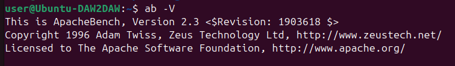
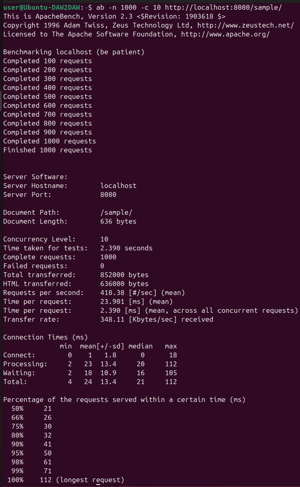
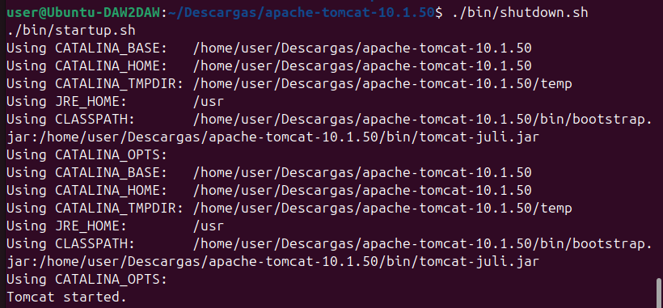
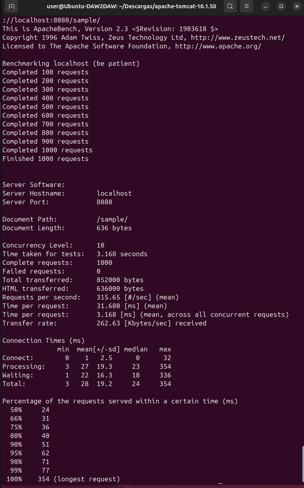

# Tomcat: Pruebas de funcionamiento y rendimiento

En esta práctica realizo pruebas de funcionamiento y rendimiento sobre una aplicación desplegada en Apache Tomcat. Para ello utilizo la herramienta **ApacheBench (ab)**, ejecuto pruebas de carga, analizo los resultados y realizo ajustes en la configuración del servidor para comparar el rendimiento antes y después.

---

## 1. Herramienta utilizada

Para realizar las pruebas de carga utilizo **ApacheBench**, una herramienta de línea de comandos que permite simular múltiples peticiones HTTP concurrentes a un servidor web.

Compruebo que ApacheBench está instalado con el comando:

```bash
ab -V
```

**Captura: comprobación de ApacheBench**




--- 

## 2. Prueba de rendimiento inicial (antes de ajustes)

Ejecuto una prueba de carga sobre la aplicación de ejemplo de Tomcat (`/sample`) utilizando 1000 peticiones con un nivel de concurrencia de 10 usuarios simultáneos:

```bash
ab -n 1000 -c 10 http://localhost:8080/sample/
```

**Captura: prueba de rendimiento inicial con ApacheBench**



### Resultados obtenidos (antes de ajustes)

- **Peticiones totales:** 1000
- **Concurrencia:** 10
- **Tiempo total de la prueba:** 2.390 segundos
- **Peticiones por segundo:** 418.38 req/s
- **Tiempo medio por petición:** 23.901 ms
- **Peticiones fallidas:** 0

Estos resultados muestran que el servidor funciona correctamente, aunque el tiempo de respuesta puede mejorarse ajustando la configuración.

---

## 3. Ajustes realizados en `server.xml`

Para mejorar el rendimiento, reviso el archivo `server.xml` y trabajo sobre los conectores HTTP/HTTPS, centrando la atención en:

- Número máximo de hilos (`maxThreads`)
- Gestión de conexiones
- Tiempo de espera (`connectionTimeout`)

Ejemplo de configuración revisada:

```xml
<Connector
    port="8080"
    protocol="HTTP/1.1"
    connectionTimeout="20000"
    redirectPort="8443"
    maxParameterCount="1000" />
```

Y para HTTPS:

```xml
<Connector port="8443"
           protocol="org.apache.coyote.http11.Http11NioProtocol"
           maxThreads="150"
           SSLEnabled="true">
```

Tras realizar los ajustes, reinicio Tomcat para que los cambios tengan efecto.

**Captura: reinicio de Tomcat tras los ajustes**



---

## 4. Prueba de rendimiento tras los ajustes

Una vez reiniciado el servidor, vuelvo a ejecutar la misma prueba de carga con ApacheBench:

```bash
ab -n 1000 -c 10 http://localhost:8080/sample/
```

**Captura: prueba de rendimiento tras los cambios**




### Resultados obtenidos (después de ajustes)

- **Peticiones totales:** 1000
- **Concurrencia:** 10
- **Tiempo total de la prueba:** 3.168 segundos
- **Peticiones por segundo:** 315.65 req/s
- **Tiempo medio por petición:** 31.680 ms
- **Peticiones fallidas:** 0

---

## 5. Comparación de resultados

| Parámetro                 | Antes de ajustes | Después de ajustes    |
|---------------------------|------------------|-----------------------|
| Peticiones totales        | 1000             | 1000                  |
| Concurrencia              | 10               | 10                    |
| Tiempo total              | 2390 s           | 3.168 s               |
| Peticiones por segundo    | 418.38 req/s     | 315.65 req/s          |
| Tiempo medio por petición | 23.901 ms        | 31.680 ms             |
| Peticiones fallidas       | 0                | 0                     |

Tras los ajustes, el servidor tarda algo más en completar la prueba. Esto puede deberse a que la configuración por defecto de Tomcat ya estaba bastante optimizada para este nivel de carga o a que los cambios realizados priorizan la estabilidad frente a la velocidad.
