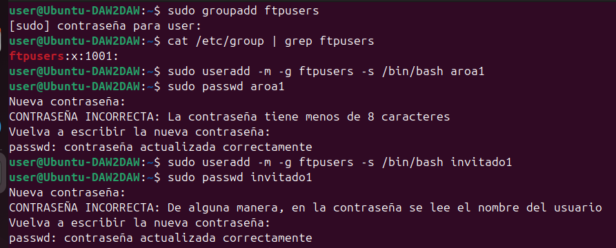
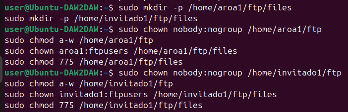
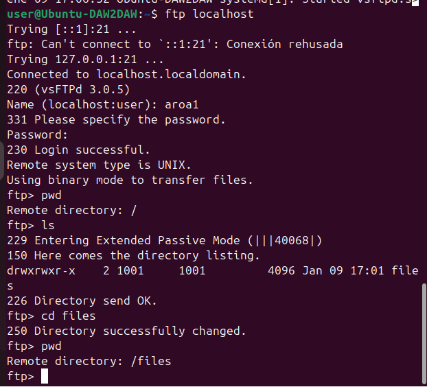

# Actividad 3: Creación de usuarios y grupos
---

## Usuarios y grupo creados

He creado un grupo llamado `ftpusers` y dos usuarios asociados a ese grupo:

### Grupo
```bash
sudo groupadd ftpusers
```

### Usuarios
```bash
sudo useradd -m -g ftpusers -s /bin/bash aroa1
sudo passwd aroa1

sudo useradd -m -g ftpusers -s /bin/bash invitado1
sudo passwd invitado1
```



---

## Configuración de directorios

He creado una estructura de directorios para cada usuario:
```bash
# Directorio raíz (solo lectura)
sudo mkdir -p /home/aroa1/ftp
sudo mkdir -p /home/invitado1/ftp

# Subdirectorio con permisos de escritura
sudo mkdir /home/aroa1/ftp/files
sudo mkdir /home/invitado1/ftp/files
```

### Permisos aplicados

**Para el directorio raíz `/ftp`:**
```bash
sudo chown nobody:nogroup /home/aroa1/ftp
sudo chmod a-w /home/aroa1/ftp
```
Este directorio es de solo lectura, el usuario puede ver pero no modificar nada.

**Para el subdirectorio `/ftp/files`:**
```bash
sudo chown aroa1:ftpusers /home/aroa1/ftp/files
sudo chmod 775 /home/aroa1/ftp/files
```
En este directorio el usuario tiene permisos completos: lectura, escritura y borrado.



---

## Configuración de límites en vsftpd

He añadido estas líneas al archivo `/etc/vsftpd.conf`:
```bash
# Permisos de archivo
file_open_mode=0666
local_umask=022

# Límites de conexión
max_clients=10
max_per_ip=2

# Lista de usuarios permitidos
userlist_enable=YES
userlist_file=/etc/vsftpd.user_list
userlist_deny=NO
```

**Explicación de los límites:**
- `max_clients=10`: Máximo 10 clientes pueden conectarse simultáneamente al servidor
- `max_per_ip=2`: Cada dirección IP puede tener máximo 2 conexiones simultáneas

También he creado el archivo `/etc/vsftpd.user_list` con los usuarios permitidos:
```
aroa1
invitado1
```
---

## Prueba de conexión

He probado la conexión con el usuario `aroa1` desde localhost:
```bash
ftp localhost
```

La conexión ha funcionado correctamente y he podido:
- Ver mi directorio raíz
- Listar el contenido con `ls`
- Entrar a la carpeta `files` con `cd files`



---

## Diferencias entre permisos de usuario y permisos de grupo

### Permisos de usuario

Los permisos de usuario son los que se aplican específicamente al propietario del archivo o directorio. En mi caso:

- `aroa1` es el **propietario** del directorio `/home/aroa1/ftp/files`
- Como propietario, tiene permisos de lectura, escritura y ejecución (rwx = 7)
- Estos permisos solo afectan a `aroa1`, nadie más

Por ejemplo, cuando hago:
```bash
sudo chown aroa1:ftpusers /home/aroa1/ftp/files
```

Estoy diciendo que `aroa1` es el propietario individual de ese directorio.

### Permisos de grupo

Los permisos de grupo se aplican a todos los usuarios que pertenecen a ese grupo. En mi caso:

- El grupo `ftpusers` tiene permisos sobre `/home/aroa1/ftp/files`
- Tanto `aroa1` como `invitado1` pertenecen al grupo `ftpusers`
- Los permisos del grupo son rwx (7), lo que significa que cualquier miembro del grupo puede leer, escribir y ejecutar

Cuando uso:
```bash
sudo chmod 775 /home/aroa1/ftp/files
```

Los números significan:
- **7** (rwx) → Permisos del **propietario** (aroa1)
- **7** (rwx) → Permisos del **grupo** (ftpusers)
- **5** (r-x) → Permisos de **otros** (solo lectura y ejecución)

### Diferencias principales

| Aspecto | Permisos de Usuario | Permisos de Grupo |
|---------|---------------------|-------------------|
| **A quién afecta** | Solo al propietario del archivo | A todos los miembros del grupo |
| **Uso típico** | Para archivos personales | Para trabajo colaborativo |
| **Ejemplo** | Mi carpeta personal solo yo la modifico | Varios usuarios del equipo pueden modificar archivos compartidos |
| **En vsftpd** | Cada usuario tiene su propio espacio | Usuarios del mismo grupo pueden compartir archivos |

### Ejemplo 

En mi configuración:

**Permisos de usuario:**
- `aroa1` puede subir, descargar y borrar archivos en `/home/aroa1/ftp/files`
- `invitado1` NO puede acceder a `/home/aroa1/ftp/files` porque no es el propietario

**Permisos de grupo:**
- Si configuro un directorio compartido con permisos de grupo, tanto `aroa1` como `invitado1` podrían trabajar juntos en los mismos archivos
- Por ejemplo, si creo `/home/compartido` y le doy permisos al grupo `ftpusers`, ambos usuarios podrían usarlo
