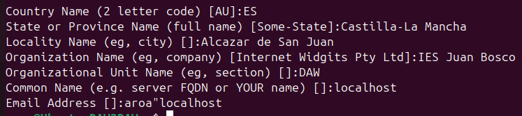
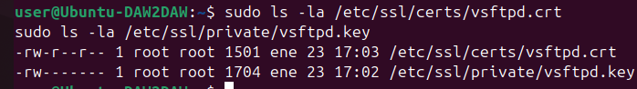
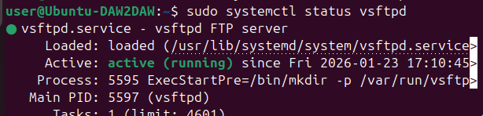
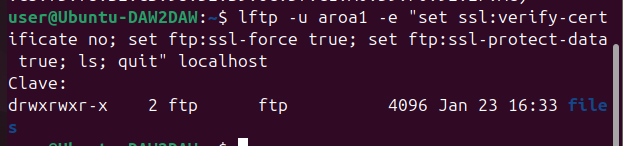
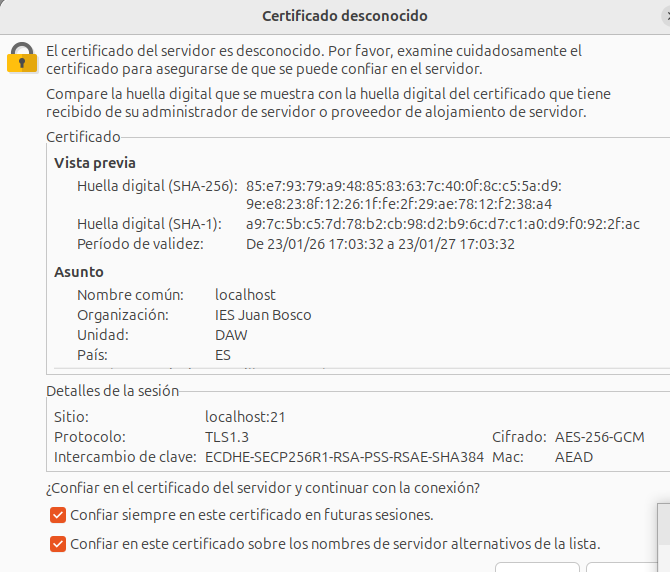
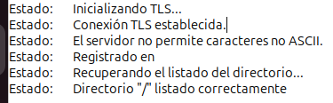
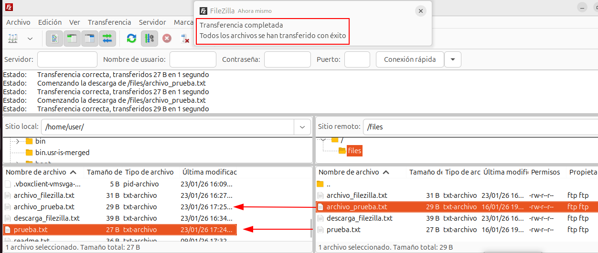
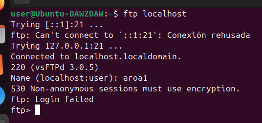

# Actividad 8: Configuración de FTP seguro (FTPS)
---

## Generación del certificado SSL/TLS

### Creación del certificado autofirmado

Para poder usar FTPS necesito un certificado SSL/TLS. He generado un certificado autofirmado válido por 365 días con el siguiente comando:
```bash
sudo openssl req -x509 -nodes -days 365 -newkey rsa:2048 \
  -keyout /etc/ssl/private/vsftpd.key \
  -out /etc/ssl/certs/vsftpd.crt
```

Durante la generación he introducido los siguientes datos:



### Verificación de los archivos

Una vez generado el certificado, he verificado que los archivos se han creado correctamente:
```bash
sudo ls -la /etc/ssl/certs/vsftpd.crt
sudo ls -la /etc/ssl/private/vsftpd.key
```



Se han creado dos archivos:
- `/etc/ssl/certs/vsftpd.crt` - El certificado público
- `/etc/ssl/private/vsftpd.key` - La clave privada (con permisos restrictivos)

---

## Configuración del servidor vsftpd para FTPS

### Modificación del archivo de configuración

He editado el archivo de configuración de vsftpd para habilitar SSL/TLS:
```bash
sudo nano /etc/vsftpd.conf
```

### Reinicio del servicio

Después de guardar los cambios, he reiniciado el servicio para aplicar la configuración:
```bash
sudo systemctl restart vsftpd
```

He verificado que el servicio seguía funcionando correctamente:
```bash
sudo systemctl status vsftpd
```



El servicio está activo y funcionando correctamente con la nueva configuración de SSL/TLS.

---

## Pruebas de conexión FTPS

### Conexión con lftp (línea de comandos)

Primero probé la conexión FTPS desde la línea de comandos usando `lftp`:
```bash
lftp -u aroa1 -e "set ssl:verify-certificate no; set ftp:ssl-force true; set ftp:ssl-protect-data true; ls; quit" localhost
```

La conexión se estableció correctamente usando SSL/TLS:



### Conexión con FileZilla Client

Para probar con un cliente gráfico, utilicé FileZilla Client.

#### Configuración de la conexión

He modificado la conexión guardada en el Gestor de sitios:

1. En el Gestor de sitios (Archivo → Gestor de sitios)
2. Selecciono mi conexión `Servidor FTP Local`
3. Cambio el **Cifrado** a: `Requerir FTP explícito sobre TLS`
4. He dejado todo lo demás sin cambios

#### Aviso de certificado desconocido

Al conectar por primera vez, FileZilla muestra un aviso de certificado desconocido:



Este aviso aparece porque el certificado es autofirmado. Compruebo que los datos del certificado coinciden con los que introduje y marco las opciones para confiar en el certificado para continuar con la conexión.

#### Conexión TLS establecida

La conexión se establece correctamente con cifrado TLS:



En los mensajes de estado veo:
- `Estado: Inicializando TLS...`
- `Estado: Conexión TLS establecida`

Esto me confirma que la conexión está cifrada usando TLS.

### Transferencia de archivos con FTPS

Realizo una transferencia de archivos para verificar que el cifrado también funciona durante las transferencias:



La transferencia se completa correctamente con cifrado activo. En los mensajes de estado se ve:
- `Transferencia completada`
- `Todos los archivos se han transferido con éxito`

Todas las transferencias de datos están protegidas por TLS.

---

## Verificación: Cifrado obligatorio

Para confirmar que el cifrado es realmente obligatorio, intenté conectarme usando el cliente `ftp` básico, que no soporta SSL/TLS:
```bash
ftp localhost
```



El servidor rechaza la conexión con el mensaje:
```
530 Non-anonymous sessions must use encryption.
Login failed.
```

Esto confirma que:
- El servidor **rechaza** conexiones sin cifrado
- Es **imposible** conectarse sin usar SSL/TLS
- La configuración de seguridad funciona correctamente
