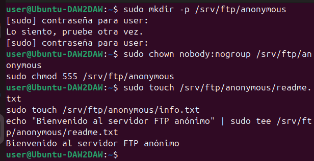

# Actividad 4: Configuración de acceso anónimo
---

## Pasos realizados

### 1. Creación del directorio para usuarios anónimos

Primero he creado un directorio específico para el acceso anónimo:
```bash
sudo mkdir -p /srv/ftp/anonymous
```

Luego he establecido los permisos de solo lectura (555 = r-xr-xr-x):
```bash
sudo chown nobody:nogroup /srv/ftp/anonymous
sudo chmod 555 /srv/ftp/anonymous
```

También he creado algunos archivos de prueba para que los usuarios anónimos puedan descargar:
```bash
sudo touch /srv/ftp/anonymous/readme.txt
sudo touch /srv/ftp/anonymous/info.txt
echo "Bienvenido al servidor FTP anónimo" | sudo tee /srv/ftp/anonymous/readme.txt
```



---

### 2. Configuración de vsftpd para acceso anónimo

He editado el archivo de configuración `/etc/vsftpd.conf`:
```bash
sudo nano /etc/vsftpd.conf
```

También activado el acceso anónimo cambiando esta línea:
```bash
anonymous_enable=YES
```


Además he añadido al final del archivo estas configuraciones:
```bash
# Configuración de acceso anónimo
anon_root=/srv/ftp/anonymous
no_anon_password=YES
hide_ids=YES

# Permisos para anónimos (solo lectura)
anon_upload_enable=NO
anon_mkdir_write_enable=NO
anon_other_write_enable=NO

# Directorio seguro para chroot
secure_chroot_dir=/var/run/vsftpd/empty
```

**Explicación de la configuración:**
- `anon_root=/srv/ftp/anonymous`: Establece el directorio raíz para usuarios anónimos
- `no_anon_password=YES`: No requiere contraseña para acceso anónimo
- `anon_upload_enable=NO`: Los anónimos NO pueden subir archivos
- `anon_mkdir_write_enable=NO`: Los anónimos NO pueden crear directorios
- `anon_other_write_enable=NO`: Los anónimos NO pueden borrar ni renombrar archivos

También he desactivado temporalmente la lista de usuarios para evitar restricciones con el acceso anónimo:
```bash
userlist_enable=NO
```

---

### 3. Reiniciar el servicio

Después de hacer los cambios, he reiniciado el servicio vsftpd:
```bash
sudo systemctl restart vsftpd
```

Compruebo que el servicio estaba funcionando correctamente:
```bash
sudo systemctl status vsftpd
```


El servicio está activo y funcionando correctamente.

---

## Prueba de conexión como usuario anónimo

### Conexión al servidor

Me he conectado al servidor FTP usando el usuario `anonymous`:
```bash
ftp localhost
```

- Usuario: `anonymous`
- Contraseña: (vacía, solo presioné Enter)


La conexión fue exitosa (`Login successful`).
Una vez conectado, he eejcutado varios comandos para probar la configuración


Como era de esperar, el servidor rechaza la subida del archivo con un error "550 Permission denied", confirmando que los usuarios anónimos solo tienen permisos de lectura.

---

## Verificación de permisos

Compruebo los permisos del directorio anónimo:
```bash
ls -la /srv/ftp/
```


El directorio `anonymous` tiene permisos `dr-xr-xr-x` (555) y pertenece a `nobody:nogroup`, lo que confirma que está configurado correctamente para solo lectura.
