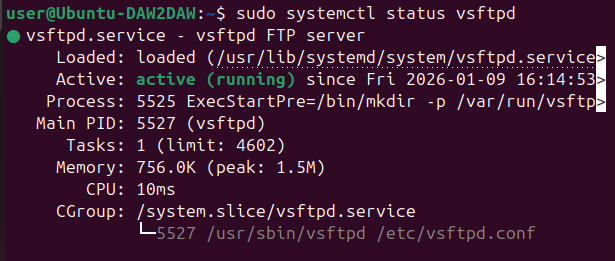

# Actividad 2: Instalación y configuración inicial del servidor FTP
---

## Servicio funcionando



El servicio vsftpd está correctamente instalado y funcionando, como se puede ver en la captura está en estado **active (running)**.

---

## Pasos que he seguido

### 1. Instalación

Primero he actualizado los repositorios y luego he instalado vsftpd, que es el servidor FTP que se usa en Linux:
```bash
sudo apt update
sudo apt install vsftpd -y
```

### 2. Configuración del archivo vsftpd.conf

Edité el archivo de configuración principal que está en `/etc/vsftpd.conf`:
```bash
sudo nano /etc/vsftpd.conf
```

Los cambios principales que he realizado han sido:

**Puerto de escucha:**
- El servidor escucha en el puerto 21 (puerto estándar de FTP)
- Esto ya venía por defecto, solo me he asegurado de que estuviera correcto

**Dirección IP:**
- He configurado `listen=YES` para que escuche en todas las interfaces de red
- Puse `listen_ipv6=NO` para usar solo IPv4

**Otras configuraciones importantes:**
- `write_enable=YES` - Para permitir subir archivos
- `chroot_local_user=YES` - Para que los usuarios solo vean su carpeta home
- Al final del archivo he añadido la configuración del modo pasivo:
```
allow_writeable_chroot=YES
pasv_enable=YES
pasv_min_port=40000
pasv_max_port=40100
```

### 3. Reiniciar el servicio

Después de modificar la configuración he reiniciado el servicio para que se aplicaran los cambios:
```bash
sudo systemctl restart vsftpd
```

### 4. Inicio automático

Para que el servicio arranque solo cuando se encienda el servidor:
```bash
sudo systemctl enable vsftpd
```

He comprobado que estaba habilitado con:
```bash
sudo systemctl is-enabled vsftpd
```

Y devuelve "enabled", así que está configurado para arrancar automáticamente.
