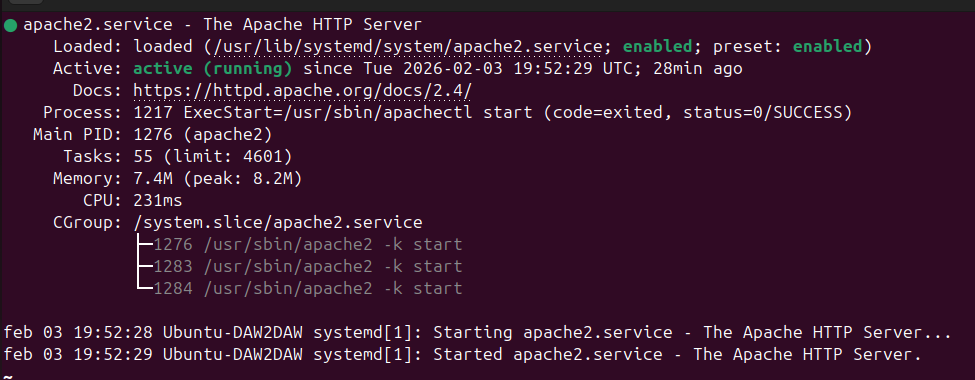
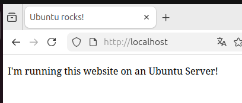
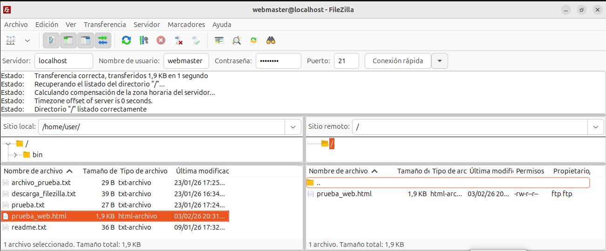
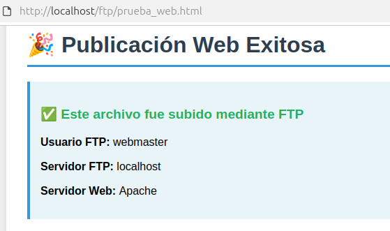

# Actividad 10: Integración de FTP con servidor web
---

## Configuración realizada

### Servidor web (Apache)

He verificado que Apache este instalado y funcionando:
```bash
sudo systemctl status apache2
```



Apache está activo:



### Usuario FTP para publicación web

Creo un usuario específico para subir contenido web:
```bash
sudo useradd -m -g www-data -s /bin/bash webmaster
sudo passwd useruser
```

### Directorio vinculado al DocumentRoot

Creo un directorio dentro del DocumentRoot de Apache:
```bash
sudo mkdir -p /var/www/html/ftp
sudo chown www-data:www-data /var/www/html/ftp
sudo chmod 755 /var/www/html/ftp
```

Y configuro vsftpd para que el usuario `webmaster` tenga este directorio como raíz:
```bash
sudo mkdir -p /etc/vsftpd/user_conf
sudo nano /etc/vsftpd/user_conf/webmaster
```

Añado:
```bash
local_root=/var/www/html/ftp
```

Reinicio el servicio:
```bash
sudo systemctl restart vsftpd
```

---

## Subida del archivo HTML

Creo un archivo HTML de prueba.

### Conexión FTP con FileZilla

Me conecto al servidor FTP usando FileZilla:
- Servidor: localhost
- Usuario: webmaster
- Contraseña: useruser
- Puerto: 21



Arrastro el archivo `prueba_web.html` desde el panel local al panel remoto. La transferencia se completó correctamente.

---

## Acceso vía HTTP

Una vez subido el archivo, accedo desde el navegador a:
```
http://localhost/ftp/prueba_web.html
```



La página se carga correctamente, mostrando el contenido HTML subido mediante FTP.

---

## Flujo completo de publicación web usando FTP

### Pasos del proceso

1. **Creación del contenido**
   - Creo un archivo HTML en mi ordenador local (`~/prueba_web.html`)

2. **Conexión al servidor FTP**
   - Abro FileZilla y me conecto con el usuario `webmaster`
   - El servidor me autentica y me sitúa en `/var/www/html/ftp`

3. **Subida del archivo**
   - Transfiero el archivo desde mi ordenador al servidor mediante FTP
   - El archivo se guarda en `/var/www/html/ftp/prueba_web.html`

4. **Publicación automática**
   - Apache detecta el nuevo archivo en su DocumentRoot
   - El archivo queda inmediatamente disponible vía HTTP

5. **Acceso desde el navegador**
   - Cualquier usuario puede acceder a `http://localhost/ftp/prueba_web.html`
   - El navegador recibe y muestra el contenido HTML

### Diagrama del flujo
```
┌──────────────────┐
│ 1. Archivo local │  prueba_web.html
│    (HTML)        │
└────────┬─────────┘
         │
         ▼
┌──────────────────┐
│ 2. Cliente FTP   │  FileZilla
│    (Puerto 21)   │  Usuario: webmaster
└────────┬─────────┘
         │
         ▼
┌──────────────────┐
│ 3. Servidor FTP  │  vsftpd
│    Transferencia │  → /var/www/html/ftp/
└────────┬─────────┘
         │
         ▼
┌──────────────────┐
│ 4. Servidor Web  │  Apache
│    (Puerto 80)   │  Sirve el archivo
└────────┬─────────┘
         │
         ▼
┌──────────────────┐
│ 5. Navegador     │  http://localhost/ftp/prueba_web.html
│    Usuario final │  Ve la página
└──────────────────┘
```
