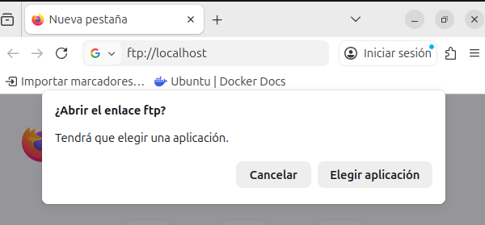
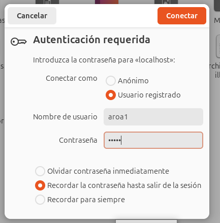
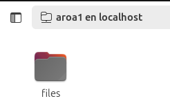
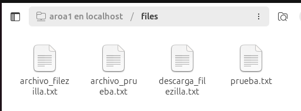

# Actividad 9: Uso del navegador como cliente FTP
---

## Acceso al servidor FTP desde el navegador

Para poder acceder desde el navegador, desactivé temporalmente el cifrado obligatorio:
```bash
sudo nano /etc/vsftpd.conf
```

Cambié estas líneas:
```bash
force_local_data_ssl=NO
force_local_logins_ssl=NO
```

Y reinicié el servicio:
```bash
sudo systemctl restart vsftpd
```

### Prueba con Firefox

Intenté acceder escribiendo en la barra de direcciones:
```
ftp://localhost
```



Firefox ya no soporta FTP de forma nativa y me pidió elegir una aplicación externa. Los navegadores modernos (Firefox, Chrome, Edge) eliminaron el soporte FTP en 2021 por motivos de seguridad y bajo uso.

### Acceso con Nautilus (gestor de archivos)

Como alternativa, probé con el gestor de archivos de Ubuntu. Abrí Nautilus, presioné Ctrl+L y escribí:
```
ftp://localhost
```



Introduje mis credenciales (usuario aroa1) y la conexión se estableció:



Pude ver la carpeta `files` y al entrar, todos los archivos del servidor:



---

## Ventajas y desventajas del navegador como cliente FTP

### Ventajas

1. **No requiere instalación adicional**
   - El navegador o gestor de archivos ya está disponible en el sistema
   - Acceso inmediato sin configuración

2. **Simplicidad**
   - Interfaz familiar y fácil de usar
   - Solo hay que escribir `ftp://servidor` en la barra de direcciones
   - Ideal para usuarios no técnicos

3. **Multiplataforma**
   - Funciona igual en Windows, Linux y Mac
   - No hay que aprender interfaces diferentes

4. **Útil para consultas rápidas**
   - Bueno para ver qué archivos hay
   - Permite descargar archivos fácilmente

### Desventajas

1. **Funcionalidad muy limitada**
   - Solo permite navegación básica y descarga
   - No permite subir archivos (o muy limitado en gestores de archivos)
   - No se pueden renombrar, borrar ni cambiar permisos
   - Sin vista de dos paneles (local y remoto)

2. **Sin gestión de transferencias**
   - No permite transferencias múltiples simultáneas
   - No se pueden reanudar descargas interrumpidas
   - Sin cola de transferencias

3. **Problemas de seguridad**
   - No soporta FTPS (FTP con SSL/TLS)
   - No soporta SFTP (SSH)
   - Credenciales quedan en el historial

4. **Sin opciones avanzadas**
   - No se puede configurar modo pasivo/activo
   - Sin filtros ni búsqueda de archivos
   - No guarda conexiones favoritas

5. **Obsoleto**
   - Los navegadores modernos ya no lo soportan
   - No es una solución viable actualmente
