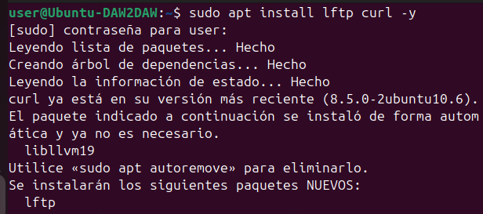
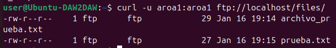
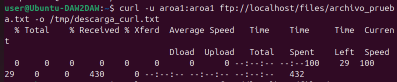
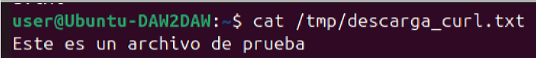
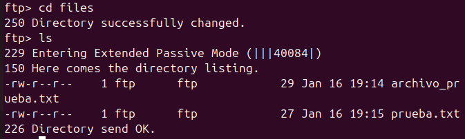
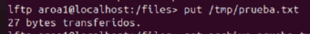
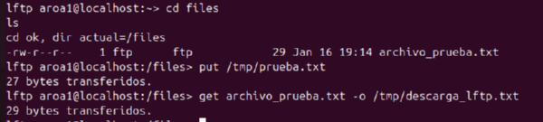
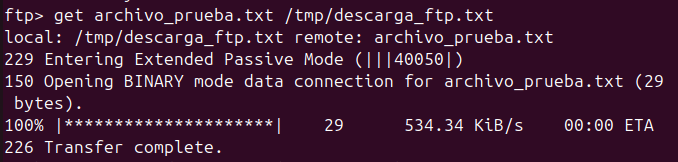

# Actividad 6 – Pruebas con clientes en línea de comandos (FTP)
---

## Instalación de los clientes FTP

Para poder realizar la actividad, instalo los clientes necesarios desde la terminal. En mi caso utilizo **curl** y **lftp**.

```bash
sudo apt install lftp curl -y
````



---

## Listado de archivos con curl

Con el cliente **curl** me conecto al servidor FTP indicando el usuario y la contraseña, y listo el contenido del directorio `files`.

```bash
curl -u aroa1:aroa1 ftp://localhost/files/
```

Con este comando puedo ver los archivos que hay en el servidor.



---

## Descarga de archivos con curl

A continuación utilizo **curl** para descargar un archivo del servidor y guardarlo en la carpeta `/tmp`.

```bash
curl -u aroa1:aroa1 ftp://localhost/files/archivo_prueba.txt -o /tmp/descarga_curl.txt
```

Este comando descarga el archivo y lo guarda con otro nombre en el sistema local.



Para comprobar que la descarga se ha realizado correctamente, muestro el contenido del archivo:

```bash
cat /tmp/descarga_curl.txt
```



---

## Conexión y operaciones con lftp

Después utilizo el cliente **lftp**, que permite trabajar de forma interactiva con el servidor FTP.

Me conecto al servidor con el siguiente comando:

```bash
lftp -u aroa1 localhost
```

Una vez dentro, accedo al directorio `files` y listo su contenido:

```bash
cd files
ls
```



---

## Subida de archivos con lftp

Con **lftp** subo un archivo desde mi equipo al servidor usando el comando `put`.

```bash
put /tmp/prueba.txt
```

El archivo se transfiere correctamente al servidor.



---

## Descarga de archivos con lftp

También utilizo **lftp** para descargar un archivo del servidor al sistema local.

```bash
get archivo_prueba.txt -o /tmp/descarga_lftp.txt
```


---

## Conexión y operaciones con el cliente ftp

Por último utilizo el cliente **ftp** tradicional.

Me conecto al servidor:

```bash
ftp localhost
```

Introduzco el usuario y la contraseña y accedo al directorio `files` para listar su contenido:

```bash
cd files
ls
```



---

## Descarga de archivos con ftp

Con el cliente **ftp** descargo un archivo del servidor:

```bash
get archivo_prueba.txt /tmp/descarga_ftp.txt
```



Para finalizar, compruebo que el archivo se ha descargado correctamente mostrando su contenido:

```bash
cat /tmp/descarga_ftp.txt
```


