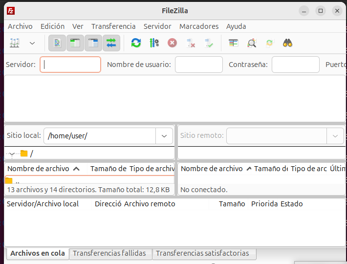
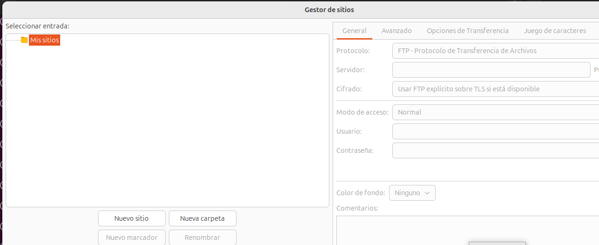
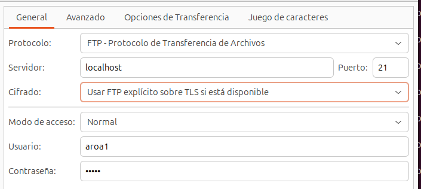
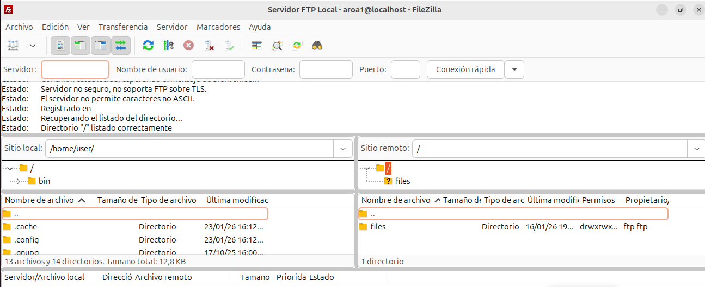
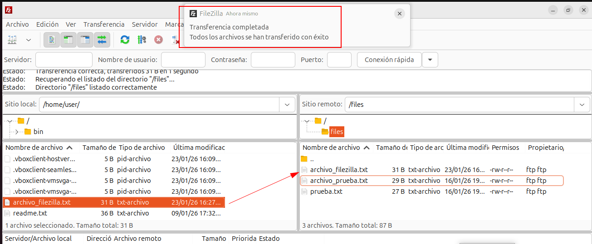
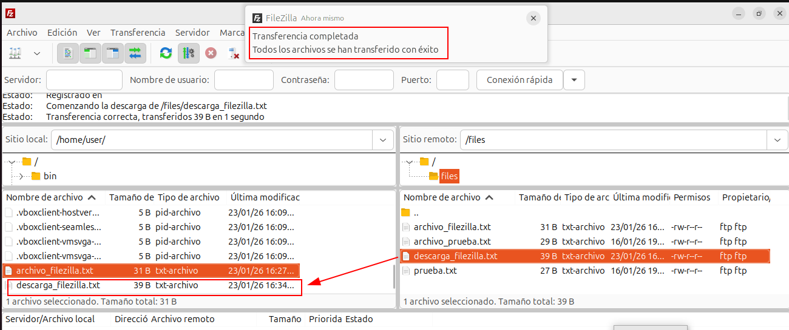
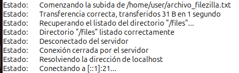
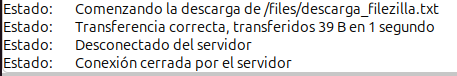

# Actividad 7: Pruebas con clientes gráficos
---

## Cliente utilizado

He utilizado **FileZilla Client**, que ya tenía instalado desde actividades anteriores.

Para abrirlo:
```bash
filezilla
```



---

## Configuración de una conexión guardada

Para no tener que introducir los datos de conexión cada vez, he configurado una conexión guardada en FileZilla.

### Pasos realizados:

1. He abierto el **Gestor de sitios** desde el menú Archivo → Gestor de sitios 



2. He hecho clic en **"Nuevo sitio"** y lo llamé `Servidor FTP Local`

3. He configurado los siguientes parámetros:
   - **Protocolo:** FTP - Protocolo de transferencia de archivos
   - **Servidor:** `localhost`
   - **Puerto:** `21`
   - **Cifrado:** Usar FTP explícito sobre TLS si está disponible
   - **Modo de acceso:** Normal
   - **Usuario:** `aroa1`
   - **Contraseña:** (contraseña de aroa1)



4. He hecho clic en **Conectar**

La conexión se ha establecido correctamente y he podido ver los archivos del servidor en el panel derecho y mis archivos locales en el panel izquierdo.



---

## Transferencia bidireccional de archivos

### Subida de archivo (Upload)

Para probar la subida de archivos, primero he creado un archivo de prueba en mi sistema:
```bash
echo "Archivo subido desde FileZilla" > ~/archivo_filezilla.txt
```

Luego en FileZilla:
1. He localizado el archivo `archivo_filezilla.txt` en el **panel izquierdo** (sitio local)
2. En el **panel derecho** (sitio remoto) he abierto a la carpeta `files`
3. He arrastrado el archivo desde el panel izquierdo al panel derecho

La transferencia se completó correctamente.



Como se puede ver en la captura:
- El archivo `archivo_filezilla.txt` aparece ahora en el servidor (panel derecho)
- FileZilla muestra una notificación de "Transferencia completada - Todos los archivos se han transferido con éxito"
- En el panel de estado se lee: "Transferencia correcta, transferidos 31 B en 1 segundo"

### Descarga de archivo (Download)

Para probar la descarga, primero he creado un archivo en el servidor:
```bash
echo "Archivo para descargar desde FileZilla" | sudo tee /home/aroa1/ftp/files/descarga_filezilla.txt
sudo chown aroa1:ftpusers /home/aroa1/ftp/files/descarga_filezilla.txt
```

Luego en FileZilla:
1. Refresco la vista del servidor (F5)
2. Localizo el archivo `descarga_filezilla.txt` en el panel derecho (remoto)
3. Lo arrastro al panel izquierdo (local)

La descarga se ha completado sin problemas.



En la captura se ve:
- El archivo `descarga_filezilla.txt` ahora también está en el panel izquierdo (descargado)
- La notificación de "Transferencia completada"
- El mensaje de estado: "Transferencia correcta, transferidos 39 B en 1 segundo"

---

## Observación de mensajes de estado

Durante todo el proceso, FileZilla mostró en el panel inferior el estado de la conexión y las transferencias en tiempo real.

### Mensajes al subir archivo



Al subir el archivo `archivo_filezilla.txt`, FileZilla mostró:
- `Estado: Comenzando la subida de /home/user/archivo_filezilla.txt`
- `Estado: Transferencia correcta, transferidos 31 B en 1 segundo`
- `Estado: Recuperando el listado del directorio "/files"...`
- `Estado: Directorio "/files" listado correctamente`

### Mensajes al descargar archivo



Al descargar el archivo `descarga_filezilla.txt`, los mensajes fueron:
- `Estado: Comenzando la descarga de /files/descarga_filezilla.txt`
- `Estado: Transferencia correcta, transferidos 39 B en 1 segundo`
- `Estado: Desconectado del servidor`
- `Estado: Conexión cerrada por el servidor`

Estos mensajes me confirman que:
- Las dos transferencias se han compleado correctamente
- Las operaciones han usado el modo pasivo (PASV) 
- El servidor responde adecuadamente en cada operación
